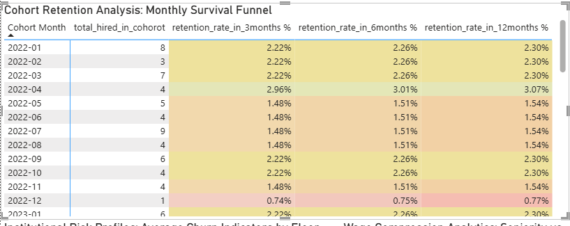
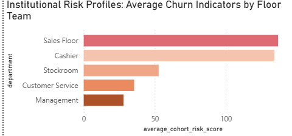
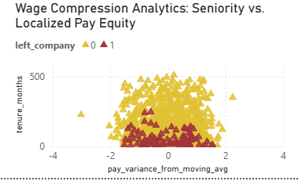

# Retail Operations & Talent Retention Command Center

## Project Summary
A production-style **People Analytics pipeline** that detects **employee flight risk before resignation**.

Built using **PostgreSQL + Power BI**, this project helps retail leaders:
- Predict attrition risk 
- Identify pay inequities 
- Improve onboarding retention 

---

##  Business Problem
Retail turnover is costly and reactive.

This solution shifts HR from:
>  ❌Reactive hiring  
>  ✅Proactive retention strategy  

---

## Key Insights
-  Sales Floor roles have the **highest churn risk**  
-  **First 90 days** are the most critical for retention  
-  Wage compression strongly drives resignations  
-  Manager changes create **attrition ripple effects**  

---

## Tech Stack

| Layer            | Tools Used |
|-----------------|-----------|
| Data Engineering | PostgreSQL, SQL (Window Functions, Views) |
| Analytics        | Power BI, DAX |
| Data Generation  | Python (pandas, numpy) |
| Dev Tools        | VS Code, Git |

**Cohort Analysis**
  - Reconstructed hire dates from tenure
  - Enabled survival funnel tracking

---

## Analytical Framework

| Layer        | Focus |
|-------------|------|
| Descriptive | What happened? |
| Diagnostic  | Why did it happen? |
| Predictive  | What will happen? |
| Prescriptive| What should we do? |

---

## Dashboard Preview

### Cohort Retention Funnel


### Risk by Department


### Wage Compression Analysis


---

## Sample Data Schema

```sql
employee_id INT
department TEXT
tenure_months INT
salary NUMERIC
manager_id INT
resignation_flag BOOLEAN
```

---

## How to Run

```bash
# Clone repository
git clone https://github.com/your-username/your-repo
cd your-repo
```

### Setup PostgreSQL
- Run scripts in `/sql`
- Create tables + analytical views

### Launch Dashboard
- Open `/reports/dashboard.pbix`
- Connect to local PostgreSQL instance

---

## Assumptions & Limitations
- Synthetic dataset (no real employee data)  
- Rule-based predictions (no ML yet)  
- Assumes consistent tenure tracking  

---

## Future Improvements
- Machine Learning churn prediction  
- Automated pipelines (dbt / Airflow)  
- Multi-region workforce support  
- Real-time dashboard refresh  

---

## Why This Project Stands Out
- End-to-end pipeline (Data → Insight → Action)  
- Strong SQL + business analytics integration  
- Real-world HR problem solving  
- Clear link between **data and decisions**  

---

## 👤 Author

**Zikisa User Kwinana**  
Junior Analytics Engineer — Cape Town, South Africa  

📧 zikisakwinana@gmail.com  
🔗 linkedin.com/in/zikisakwinana  

---

## If you found this useful
Give the repo a star and connect!
